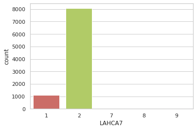
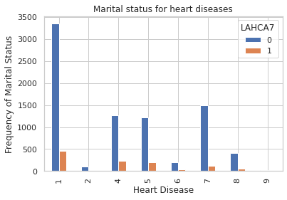
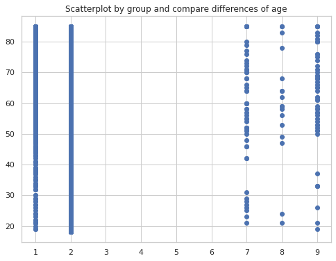
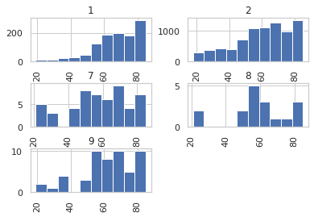

[Home](https://maxshalom.com/arise/) 

## Project Code

### Goals:

*   to predict heart/stroke problems, they are indicated as variables LAHCA7 and LAHCA8 respectively.
*   to identify some variables you think would be relevant and trying out some summary using pandas, for example, get the percentage of categorical variables(ethnicity, marital status), average for continuous variables(age, income, etc), or plotting


#### Import packages and code


```
import pandas as pd
import numpy as np
import IPython 
import matplotlib.pyplot as plt
from sklearn import preprocessing
from sklearn.linear_model import LogisticRegression
from sklearn.model_selection import train_test_split
import seaborn as sns
sns.set(style="white")
sns.set(style="whitegrid", color_codes=True)
```


```
persons_data = pd.read_csv('https://raw.githubusercontent.com/MaxShalom/arise/master/personsx1.csv', delimiter = ',')
persons_data.head()
```


<div>
<style scoped>
    .dataframe tbody tr th:only-of-type {
        vertical-align: middle;
    }

    .dataframe tbody tr th {
        vertical-align: top;
    }
    
    .dataframe thead th {
        text-align: right;
    }
</style>
<table border="1" class="dataframe">
  <thead>
    <tr style="text-align: right;">
      <th></th>
      <th>FPX</th>
      <th>AGE_CHG</th>
      <th>INTV_QRT</th>
      <th>SEX</th>
      <th>NOWAF</th>
      <th>FSPOUS2</th>
      <th>COHAB1</th>
      <th>COHAB2</th>
      <th>FCOHAB3</th>
      <th>ASTATFLG</th>
      <th>CSTATFLG</th>
      <th>FMX</th>
      <th>RRP</th>
      <th>FRRP</th>
      <th>ORIGIN_I</th>
      <th>HISPAN_I</th>
      <th>RACRECI3</th>
      <th>QCADULT</th>
      <th>QCCHILD</th>
      <th>R_MARITL</th>
      <th>MRACRPI2</th>
      <th>RACERPI2</th>
      <th>HISCODI3</th>
      <th>MRACBPI2</th>
      <th>AGE_P</th>
      <th>HHREFLG</th>
      <th>RECTYPE</th>
      <th>SRVY_YR</th>
      <th>FMREFLG</th>
      <th>FMRPFLG</th>
      <th>PARENTS</th>
      <th>DAD_DEGP</th>
      <th>MOM_DEGP</th>
      <th>SIB_DEGP</th>
      <th>CDCMSTAT</th>
      <th>DAD_ED</th>
      <th>MOM_ED</th>
      <th>FMOTHER1</th>
      <th>FFATHER1</th>
      <th>HHX</th>
      <th>...</th>
      <th>MAFLG</th>
      <th>CHFLG</th>
      <th>OPFLG</th>
      <th>OGFLG</th>
      <th>WHONAM1</th>
      <th>WHONAM2</th>
      <th>NOTCOV</th>
      <th>PRPLPLUS</th>
      <th>PWRKBR1</th>
      <th>COVER</th>
      <th>COVER65O</th>
      <th>COVER65</th>
      <th>REGIONBR</th>
      <th>WHYNOWKP</th>
      <th>GEOBRTH</th>
      <th>YRSINUS</th>
      <th>CITIZENP</th>
      <th>DOINGLWP</th>
      <th>WRKLYR1</th>
      <th>WRKHRS2</th>
      <th>PLBORN</th>
      <th>HEADST</th>
      <th>HEADSTV1</th>
      <th>ARMFVER</th>
      <th>ARMFEV</th>
      <th>ARMFFC</th>
      <th>VACOV</th>
      <th>WRKFTALL</th>
      <th>WRKMYR</th>
      <th>HIEMPOF</th>
      <th>EDUC1</th>
      <th>ERNYR_P</th>
      <th>ARMFTM7P</th>
      <th>ARMFTM1P</th>
      <th>ARMFTM2P</th>
      <th>ARMFTM3P</th>
      <th>ARMFTM4P</th>
      <th>ARMFTM5P</th>
      <th>ARMFTM6P</th>
      <th>ENGLANG</th>
    </tr>
  </thead>
  <tbody>
    <tr>
      <th>0</th>
      <td>1</td>
      <td>NaN</td>
      <td>1</td>
      <td>1</td>
      <td>NaN</td>
      <td>NaN</td>
      <td>NaN</td>
      <td>NaN</td>
      <td>NaN</td>
      <td>1</td>
      <td>NaN</td>
      <td>1</td>
      <td>1</td>
      <td>1</td>
      <td>2</td>
      <td>12</td>
      <td>3</td>
      <td>NaN</td>
      <td>NaN</td>
      <td>4</td>
      <td>11</td>
      <td>4</td>
      <td>4</td>
      <td>7</td>
      <td>75</td>
      <td>P</td>
      <td>20</td>
      <td>2018</td>
      <td>P</td>
      <td>B</td>
      <td>4</td>
      <td>NaN</td>
      <td>NaN</td>
      <td>NaN</td>
      <td>5</td>
      <td>NaN</td>
      <td>NaN</td>
      <td>0</td>
      <td>0</td>
      <td>9</td>
      <td>...</td>
      <td>NaN</td>
      <td>NaN</td>
      <td>NaN</td>
      <td>NaN</td>
      <td>1.0</td>
      <td>NaN</td>
      <td>2</td>
      <td>2.0</td>
      <td>NaN</td>
      <td>NaN</td>
      <td>1.0</td>
      <td>1.0</td>
      <td>1</td>
      <td>3.0</td>
      <td>1</td>
      <td>NaN</td>
      <td>1</td>
      <td>5</td>
      <td>2</td>
      <td>NaN</td>
      <td>1</td>
      <td>NaN</td>
      <td>NaN</td>
      <td>NaN</td>
      <td>2</td>
      <td>NaN</td>
      <td>NaN</td>
      <td>NaN</td>
      <td>NaN</td>
      <td>NaN</td>
      <td>10</td>
      <td>NaN</td>
      <td>NaN</td>
      <td>NaN</td>
      <td>NaN</td>
      <td>NaN</td>
      <td>NaN</td>
      <td>NaN</td>
      <td>NaN</td>
      <td>1</td>
    </tr>
    <tr>
      <th>1</th>
      <td>1</td>
      <td>NaN</td>
      <td>1</td>
      <td>1</td>
      <td>NaN</td>
      <td>2.0</td>
      <td>NaN</td>
      <td>NaN</td>
      <td>NaN</td>
      <td>1</td>
      <td>NaN</td>
      <td>1</td>
      <td>1</td>
      <td>1</td>
      <td>2</td>
      <td>12</td>
      <td>1</td>
      <td>NaN</td>
      <td>NaN</td>
      <td>1</td>
      <td>1</td>
      <td>1</td>
      <td>2</td>
      <td>1</td>
      <td>68</td>
      <td>P</td>
      <td>20</td>
      <td>2018</td>
      <td>P</td>
      <td>B</td>
      <td>4</td>
      <td>NaN</td>
      <td>NaN</td>
      <td>NaN</td>
      <td>3</td>
      <td>NaN</td>
      <td>NaN</td>
      <td>0</td>
      <td>0</td>
      <td>20</td>
      <td>...</td>
      <td>NaN</td>
      <td>NaN</td>
      <td>NaN</td>
      <td>NaN</td>
      <td>1.0</td>
      <td>NaN</td>
      <td>2</td>
      <td>2.0</td>
      <td>NaN</td>
      <td>NaN</td>
      <td>1.0</td>
      <td>1.0</td>
      <td>1</td>
      <td>3.0</td>
      <td>1</td>
      <td>NaN</td>
      <td>1</td>
      <td>5</td>
      <td>2</td>
      <td>NaN</td>
      <td>1</td>
      <td>NaN</td>
      <td>NaN</td>
      <td>NaN</td>
      <td>2</td>
      <td>NaN</td>
      <td>NaN</td>
      <td>NaN</td>
      <td>NaN</td>
      <td>NaN</td>
      <td>16</td>
      <td>NaN</td>
      <td>NaN</td>
      <td>NaN</td>
      <td>NaN</td>
      <td>NaN</td>
      <td>NaN</td>
      <td>NaN</td>
      <td>NaN</td>
      <td>1</td>
    </tr>
    <tr>
      <th>2</th>
      <td>1</td>
      <td>NaN</td>
      <td>1</td>
      <td>1</td>
      <td>NaN</td>
      <td>NaN</td>
      <td>NaN</td>
      <td>NaN</td>
      <td>NaN</td>
      <td>1</td>
      <td>NaN</td>
      <td>1</td>
      <td>1</td>
      <td>1</td>
      <td>2</td>
      <td>12</td>
      <td>2</td>
      <td>NaN</td>
      <td>NaN</td>
      <td>4</td>
      <td>2</td>
      <td>2</td>
      <td>3</td>
      <td>2</td>
      <td>76</td>
      <td>P</td>
      <td>20</td>
      <td>2018</td>
      <td>P</td>
      <td>B</td>
      <td>4</td>
      <td>NaN</td>
      <td>NaN</td>
      <td>NaN</td>
      <td>5</td>
      <td>NaN</td>
      <td>NaN</td>
      <td>0</td>
      <td>0</td>
      <td>21</td>
      <td>...</td>
      <td>NaN</td>
      <td>NaN</td>
      <td>NaN</td>
      <td>NaN</td>
      <td>NaN</td>
      <td>NaN</td>
      <td>2</td>
      <td>NaN</td>
      <td>NaN</td>
      <td>NaN</td>
      <td>2.0</td>
      <td>2.0</td>
      <td>1</td>
      <td>3.0</td>
      <td>1</td>
      <td>NaN</td>
      <td>1</td>
      <td>5</td>
      <td>2</td>
      <td>NaN</td>
      <td>1</td>
      <td>NaN</td>
      <td>NaN</td>
      <td>NaN</td>
      <td>2</td>
      <td>NaN</td>
      <td>NaN</td>
      <td>NaN</td>
      <td>NaN</td>
      <td>NaN</td>
      <td>14</td>
      <td>NaN</td>
      <td>NaN</td>
      <td>NaN</td>
      <td>NaN</td>
      <td>NaN</td>
      <td>NaN</td>
      <td>NaN</td>
      <td>NaN</td>
      <td>1</td>
    </tr>
    <tr>
      <th>3</th>
      <td>1</td>
      <td>NaN</td>
      <td>1</td>
      <td>2</td>
      <td>NaN</td>
      <td>NaN</td>
      <td>NaN</td>
      <td>NaN</td>
      <td>NaN</td>
      <td>1</td>
      <td>NaN</td>
      <td>1</td>
      <td>1</td>
      <td>1</td>
      <td>2</td>
      <td>12</td>
      <td>1</td>
      <td>NaN</td>
      <td>NaN</td>
      <td>4</td>
      <td>1</td>
      <td>1</td>
      <td>2</td>
      <td>1</td>
      <td>67</td>
      <td>P</td>
      <td>20</td>
      <td>2018</td>
      <td>P</td>
      <td>B</td>
      <td>4</td>
      <td>NaN</td>
      <td>NaN</td>
      <td>NaN</td>
      <td>5</td>
      <td>NaN</td>
      <td>NaN</td>
      <td>0</td>
      <td>0</td>
      <td>22</td>
      <td>...</td>
      <td>NaN</td>
      <td>NaN</td>
      <td>NaN</td>
      <td>NaN</td>
      <td>1.0</td>
      <td>NaN</td>
      <td>2</td>
      <td>2.0</td>
      <td>NaN</td>
      <td>NaN</td>
      <td>1.0</td>
      <td>1.0</td>
      <td>1</td>
      <td>9.0</td>
      <td>1</td>
      <td>NaN</td>
      <td>1</td>
      <td>5</td>
      <td>2</td>
      <td>NaN</td>
      <td>1</td>
      <td>NaN</td>
      <td>NaN</td>
      <td>NaN</td>
      <td>2</td>
      <td>NaN</td>
      <td>NaN</td>
      <td>NaN</td>
      <td>NaN</td>
      <td>NaN</td>
      <td>14</td>
      <td>NaN</td>
      <td>NaN</td>
      <td>NaN</td>
      <td>NaN</td>
      <td>NaN</td>
      <td>NaN</td>
      <td>NaN</td>
      <td>NaN</td>
      <td>1</td>
    </tr>
    <tr>
      <th>4</th>
      <td>1</td>
      <td>NaN</td>
      <td>1</td>
      <td>1</td>
      <td>NaN</td>
      <td>NaN</td>
      <td>NaN</td>
      <td>NaN</td>
      <td>NaN</td>
      <td>1</td>
      <td>NaN</td>
      <td>1</td>
      <td>1</td>
      <td>1</td>
      <td>2</td>
      <td>12</td>
      <td>1</td>
      <td>NaN</td>
      <td>NaN</td>
      <td>5</td>
      <td>1</td>
      <td>1</td>
      <td>2</td>
      <td>1</td>
      <td>65</td>
      <td>P</td>
      <td>20</td>
      <td>2018</td>
      <td>P</td>
      <td>B</td>
      <td>4</td>
      <td>NaN</td>
      <td>NaN</td>
      <td>NaN</td>
      <td>2</td>
      <td>NaN</td>
      <td>NaN</td>
      <td>0</td>
      <td>0</td>
      <td>24</td>
      <td>...</td>
      <td>NaN</td>
      <td>NaN</td>
      <td>NaN</td>
      <td>NaN</td>
      <td>NaN</td>
      <td>NaN</td>
      <td>2</td>
      <td>NaN</td>
      <td>NaN</td>
      <td>NaN</td>
      <td>4.0</td>
      <td>5.0</td>
      <td>1</td>
      <td>NaN</td>
      <td>1</td>
      <td>NaN</td>
      <td>1</td>
      <td>1</td>
      <td>1</td>
      <td>40.0</td>
      <td>1</td>
      <td>NaN</td>
      <td>NaN</td>
      <td>NaN</td>
      <td>1</td>
      <td>1.0</td>
      <td>NaN</td>
      <td>NaN</td>
      <td>4.0</td>
      <td>2.0</td>
      <td>14</td>
      <td>2.0</td>
      <td>NaN</td>
      <td>2.0</td>
      <td>2.0</td>
      <td>1.0</td>
      <td>1.0</td>
      <td>NaN</td>
      <td>NaN</td>
      <td>1</td>
    </tr>
  </tbody>
</table>
<p>5 rows × 602 columns</p>
</div>


#### Sex count 
1 = Male, 2 = Female


```
persons_data.groupby("SEX").count()
```


<div>
<style scoped>
    .dataframe tbody tr th:only-of-type {
        vertical-align: middle;
    }

    .dataframe tbody tr th {
        vertical-align: top;
    }
    
    .dataframe thead th {
        text-align: right;
    }
</style>
<table border="1" class="dataframe">
  <thead>
    <tr style="text-align: right;">
      <th></th>
      <th>FPX</th>
      <th>AGE_CHG</th>
      <th>INTV_QRT</th>
      <th>NOWAF</th>
      <th>FSPOUS2</th>
      <th>COHAB1</th>
      <th>COHAB2</th>
      <th>FCOHAB3</th>
      <th>ASTATFLG</th>
      <th>CSTATFLG</th>
      <th>FMX</th>
      <th>RRP</th>
      <th>FRRP</th>
      <th>ORIGIN_I</th>
      <th>HISPAN_I</th>
      <th>RACRECI3</th>
      <th>QCADULT</th>
      <th>QCCHILD</th>
      <th>R_MARITL</th>
      <th>MRACRPI2</th>
      <th>RACERPI2</th>
      <th>HISCODI3</th>
      <th>MRACBPI2</th>
      <th>AGE_P</th>
      <th>HHREFLG</th>
      <th>RECTYPE</th>
      <th>SRVY_YR</th>
      <th>FMREFLG</th>
      <th>FMRPFLG</th>
      <th>PARENTS</th>
      <th>DAD_DEGP</th>
      <th>MOM_DEGP</th>
      <th>SIB_DEGP</th>
      <th>CDCMSTAT</th>
      <th>DAD_ED</th>
      <th>MOM_ED</th>
      <th>FMOTHER1</th>
      <th>FFATHER1</th>
      <th>HHX</th>
      <th>WTIA</th>
      <th>...</th>
      <th>MAFLG</th>
      <th>CHFLG</th>
      <th>OPFLG</th>
      <th>OGFLG</th>
      <th>WHONAM1</th>
      <th>WHONAM2</th>
      <th>NOTCOV</th>
      <th>PRPLPLUS</th>
      <th>PWRKBR1</th>
      <th>COVER</th>
      <th>COVER65O</th>
      <th>COVER65</th>
      <th>REGIONBR</th>
      <th>WHYNOWKP</th>
      <th>GEOBRTH</th>
      <th>YRSINUS</th>
      <th>CITIZENP</th>
      <th>DOINGLWP</th>
      <th>WRKLYR1</th>
      <th>WRKHRS2</th>
      <th>PLBORN</th>
      <th>HEADST</th>
      <th>HEADSTV1</th>
      <th>ARMFVER</th>
      <th>ARMFEV</th>
      <th>ARMFFC</th>
      <th>VACOV</th>
      <th>WRKFTALL</th>
      <th>WRKMYR</th>
      <th>HIEMPOF</th>
      <th>EDUC1</th>
      <th>ERNYR_P</th>
      <th>ARMFTM7P</th>
      <th>ARMFTM1P</th>
      <th>ARMFTM2P</th>
      <th>ARMFTM3P</th>
      <th>ARMFTM4P</th>
      <th>ARMFTM5P</th>
      <th>ARMFTM6P</th>
      <th>ENGLANG</th>
    </tr>
    <tr>
      <th>SEX</th>
      <th></th>
      <th></th>
      <th></th>
      <th></th>
      <th></th>
      <th></th>
      <th></th>
      <th></th>
      <th></th>
      <th></th>
      <th></th>
      <th></th>
      <th></th>
      <th></th>
      <th></th>
      <th></th>
      <th></th>
      <th></th>
      <th></th>
      <th></th>
      <th></th>
      <th></th>
      <th></th>
      <th></th>
      <th></th>
      <th></th>
      <th></th>
      <th></th>
      <th></th>
      <th></th>
      <th></th>
      <th></th>
      <th></th>
      <th></th>
      <th></th>
      <th></th>
      <th></th>
      <th></th>
      <th></th>
      <th></th>
      <th></th>
      <th></th>
      <th></th>
      <th></th>
      <th></th>
      <th></th>
      <th></th>
      <th></th>
      <th></th>
      <th></th>
      <th></th>
      <th></th>
      <th></th>
      <th></th>
      <th></th>
      <th></th>
      <th></th>
      <th></th>
      <th></th>
      <th></th>
      <th></th>
      <th></th>
      <th></th>
      <th></th>
      <th></th>
      <th></th>
      <th></th>
      <th></th>
      <th></th>
      <th></th>
      <th></th>
      <th></th>
      <th></th>
      <th></th>
      <th></th>
      <th></th>
      <th></th>
      <th></th>
      <th></th>
      <th></th>
      <th></th>
    </tr>
  </thead>
  <tbody>
    <tr>
      <th>1</th>
      <td>4208</td>
      <td>0</td>
      <td>4208</td>
      <td>2356</td>
      <td>2020</td>
      <td>230</td>
      <td>145</td>
      <td>230</td>
      <td>4208</td>
      <td>0</td>
      <td>4208</td>
      <td>4208</td>
      <td>4208</td>
      <td>4208</td>
      <td>4208</td>
      <td>4208</td>
      <td>2</td>
      <td>0</td>
      <td>4208</td>
      <td>4208</td>
      <td>4208</td>
      <td>4208</td>
      <td>4208</td>
      <td>4208</td>
      <td>2542</td>
      <td>4208</td>
      <td>4208</td>
      <td>2578</td>
      <td>2431</td>
      <td>4208</td>
      <td>279</td>
      <td>484</td>
      <td>55</td>
      <td>4208</td>
      <td>0</td>
      <td>0</td>
      <td>4208</td>
      <td>4208</td>
      <td>4208</td>
      <td>4208</td>
      <td>...</td>
      <td>6</td>
      <td>0</td>
      <td>0</td>
      <td>0</td>
      <td>1652</td>
      <td>63</td>
      <td>4208</td>
      <td>1635</td>
      <td>203</td>
      <td>2356</td>
      <td>1852</td>
      <td>1852</td>
      <td>4208</td>
      <td>3225</td>
      <td>4208</td>
      <td>449</td>
      <td>4208</td>
      <td>4208</td>
      <td>4208</td>
      <td>975</td>
      <td>4208</td>
      <td>0</td>
      <td>0</td>
      <td>12</td>
      <td>4208</td>
      <td>1305</td>
      <td>924</td>
      <td>380</td>
      <td>1143</td>
      <td>918</td>
      <td>4208</td>
      <td>1143</td>
      <td>216</td>
      <td>1039</td>
      <td>1234</td>
      <td>1216</td>
      <td>1035</td>
      <td>698</td>
      <td>368</td>
      <td>4208</td>
    </tr>
    <tr>
      <th>2</th>
      <td>5080</td>
      <td>0</td>
      <td>5080</td>
      <td>2581</td>
      <td>1841</td>
      <td>243</td>
      <td>154</td>
      <td>243</td>
      <td>5080</td>
      <td>0</td>
      <td>5080</td>
      <td>5080</td>
      <td>5080</td>
      <td>5080</td>
      <td>5080</td>
      <td>5080</td>
      <td>6</td>
      <td>0</td>
      <td>5080</td>
      <td>5080</td>
      <td>5080</td>
      <td>5080</td>
      <td>5080</td>
      <td>5080</td>
      <td>3248</td>
      <td>5080</td>
      <td>5080</td>
      <td>3286</td>
      <td>3442</td>
      <td>5080</td>
      <td>152</td>
      <td>309</td>
      <td>76</td>
      <td>5080</td>
      <td>0</td>
      <td>0</td>
      <td>5080</td>
      <td>5080</td>
      <td>5080</td>
      <td>5080</td>
      <td>...</td>
      <td>14</td>
      <td>0</td>
      <td>4</td>
      <td>0</td>
      <td>2086</td>
      <td>75</td>
      <td>5080</td>
      <td>2065</td>
      <td>203</td>
      <td>2581</td>
      <td>2499</td>
      <td>2499</td>
      <td>5080</td>
      <td>4161</td>
      <td>5080</td>
      <td>669</td>
      <td>5080</td>
      <td>5080</td>
      <td>5080</td>
      <td>962</td>
      <td>5080</td>
      <td>0</td>
      <td>0</td>
      <td>3</td>
      <td>5080</td>
      <td>99</td>
      <td>75</td>
      <td>452</td>
      <td>1095</td>
      <td>880</td>
      <td>5080</td>
      <td>1095</td>
      <td>7</td>
      <td>90</td>
      <td>84</td>
      <td>80</td>
      <td>47</td>
      <td>22</td>
      <td>11</td>
      <td>5080</td>
    </tr>
  </tbody>
</table>
<p>2 rows × 601 columns</p>
</div>


#### Value count of disease types
`LAHCA7`: Persons 18+ years who have at least one limitation due to a heart problem<br> 


Heart problem causes limitation:


> 1 - Mentioned <br>
2 - Not mentioned<br>
7 - Refused<br>
8 - Not ascertained<br>
9 - Don't know


```
persons_data["LAHCA7"].unique()
persons_data["LAHCA7"].value_counts()
sns.countplot(x="LAHCA7",data=persons_data,palette="hls")
plt.show()
persons_data_sub=persons_data.loc[persons_data['LAHCA7'] <=2]
```





```
persons_data.groupby("LAHCA7").count()
```


<div>
<style scoped>
    .dataframe tbody tr th:only-of-type {
        vertical-align: middle;
    }

    .dataframe tbody tr th {
        vertical-align: top;
    }
    
    .dataframe thead th {
        text-align: right;
    }
</style>
<table border="1" class="dataframe">
  <thead>
    <tr style="text-align: right;">
      <th></th>
      <th>FPX</th>
      <th>AGE_CHG</th>
      <th>INTV_QRT</th>
      <th>SEX</th>
      <th>NOWAF</th>
      <th>FSPOUS2</th>
      <th>COHAB1</th>
      <th>COHAB2</th>
      <th>FCOHAB3</th>
      <th>ASTATFLG</th>
      <th>CSTATFLG</th>
      <th>FMX</th>
      <th>RRP</th>
      <th>FRRP</th>
      <th>ORIGIN_I</th>
      <th>HISPAN_I</th>
      <th>RACRECI3</th>
      <th>QCADULT</th>
      <th>QCCHILD</th>
      <th>R_MARITL</th>
      <th>MRACRPI2</th>
      <th>RACERPI2</th>
      <th>HISCODI3</th>
      <th>MRACBPI2</th>
      <th>AGE_P</th>
      <th>HHREFLG</th>
      <th>RECTYPE</th>
      <th>SRVY_YR</th>
      <th>FMREFLG</th>
      <th>FMRPFLG</th>
      <th>PARENTS</th>
      <th>DAD_DEGP</th>
      <th>MOM_DEGP</th>
      <th>SIB_DEGP</th>
      <th>CDCMSTAT</th>
      <th>DAD_ED</th>
      <th>MOM_ED</th>
      <th>FMOTHER1</th>
      <th>FFATHER1</th>
      <th>HHX</th>
      <th>...</th>
      <th>MAFLG</th>
      <th>CHFLG</th>
      <th>OPFLG</th>
      <th>OGFLG</th>
      <th>WHONAM1</th>
      <th>WHONAM2</th>
      <th>NOTCOV</th>
      <th>PRPLPLUS</th>
      <th>PWRKBR1</th>
      <th>COVER</th>
      <th>COVER65O</th>
      <th>COVER65</th>
      <th>REGIONBR</th>
      <th>WHYNOWKP</th>
      <th>GEOBRTH</th>
      <th>YRSINUS</th>
      <th>CITIZENP</th>
      <th>DOINGLWP</th>
      <th>WRKLYR1</th>
      <th>WRKHRS2</th>
      <th>PLBORN</th>
      <th>HEADST</th>
      <th>HEADSTV1</th>
      <th>ARMFVER</th>
      <th>ARMFEV</th>
      <th>ARMFFC</th>
      <th>VACOV</th>
      <th>WRKFTALL</th>
      <th>WRKMYR</th>
      <th>HIEMPOF</th>
      <th>EDUC1</th>
      <th>ERNYR_P</th>
      <th>ARMFTM7P</th>
      <th>ARMFTM1P</th>
      <th>ARMFTM2P</th>
      <th>ARMFTM3P</th>
      <th>ARMFTM4P</th>
      <th>ARMFTM5P</th>
      <th>ARMFTM6P</th>
      <th>ENGLANG</th>
    </tr>
    <tr>
      <th>LAHCA7</th>
      <th></th>
      <th></th>
      <th></th>
      <th></th>
      <th></th>
      <th></th>
      <th></th>
      <th></th>
      <th></th>
      <th></th>
      <th></th>
      <th></th>
      <th></th>
      <th></th>
      <th></th>
      <th></th>
      <th></th>
      <th></th>
      <th></th>
      <th></th>
      <th></th>
      <th></th>
      <th></th>
      <th></th>
      <th></th>
      <th></th>
      <th></th>
      <th></th>
      <th></th>
      <th></th>
      <th></th>
      <th></th>
      <th></th>
      <th></th>
      <th></th>
      <th></th>
      <th></th>
      <th></th>
      <th></th>
      <th></th>
      <th></th>
      <th></th>
      <th></th>
      <th></th>
      <th></th>
      <th></th>
      <th></th>
      <th></th>
      <th></th>
      <th></th>
      <th></th>
      <th></th>
      <th></th>
      <th></th>
      <th></th>
      <th></th>
      <th></th>
      <th></th>
      <th></th>
      <th></th>
      <th></th>
      <th></th>
      <th></th>
      <th></th>
      <th></th>
      <th></th>
      <th></th>
      <th></th>
      <th></th>
      <th></th>
      <th></th>
      <th></th>
      <th></th>
      <th></th>
      <th></th>
      <th></th>
      <th></th>
      <th></th>
      <th></th>
      <th></th>
      <th></th>
    </tr>
  </thead>
  <tbody>
    <tr>
      <th>1</th>
      <td>1103</td>
      <td>0</td>
      <td>1103</td>
      <td>1103</td>
      <td>414</td>
      <td>456</td>
      <td>46</td>
      <td>36</td>
      <td>46</td>
      <td>1103</td>
      <td>0</td>
      <td>1103</td>
      <td>1103</td>
      <td>1103</td>
      <td>1103</td>
      <td>1103</td>
      <td>1103</td>
      <td>0</td>
      <td>0</td>
      <td>1103</td>
      <td>1103</td>
      <td>1103</td>
      <td>1103</td>
      <td>1103</td>
      <td>1103</td>
      <td>722</td>
      <td>1103</td>
      <td>1103</td>
      <td>727</td>
      <td>700</td>
      <td>1103</td>
      <td>28</td>
      <td>50</td>
      <td>8</td>
      <td>1103</td>
      <td>0</td>
      <td>0</td>
      <td>1103</td>
      <td>1103</td>
      <td>1103</td>
      <td>...</td>
      <td>2</td>
      <td>0</td>
      <td>1</td>
      <td>0</td>
      <td>412</td>
      <td>17</td>
      <td>1103</td>
      <td>405</td>
      <td>33</td>
      <td>414</td>
      <td>689</td>
      <td>689</td>
      <td>1103</td>
      <td>978</td>
      <td>1103</td>
      <td>121</td>
      <td>1103</td>
      <td>1103</td>
      <td>1103</td>
      <td>133</td>
      <td>1103</td>
      <td>0</td>
      <td>0</td>
      <td>1</td>
      <td>1103</td>
      <td>236</td>
      <td>168</td>
      <td>69</td>
      <td>163</td>
      <td>120</td>
      <td>1103</td>
      <td>163</td>
      <td>40</td>
      <td>187</td>
      <td>230</td>
      <td>235</td>
      <td>208</td>
      <td>146</td>
      <td>77</td>
      <td>1103</td>
    </tr>
    <tr>
      <th>2</th>
      <td>8062</td>
      <td>0</td>
      <td>8062</td>
      <td>8062</td>
      <td>4453</td>
      <td>3351</td>
      <td>415</td>
      <td>259</td>
      <td>415</td>
      <td>8062</td>
      <td>0</td>
      <td>8062</td>
      <td>8062</td>
      <td>8062</td>
      <td>8062</td>
      <td>8062</td>
      <td>8062</td>
      <td>6</td>
      <td>0</td>
      <td>8062</td>
      <td>8062</td>
      <td>8062</td>
      <td>8062</td>
      <td>8062</td>
      <td>8062</td>
      <td>4998</td>
      <td>8062</td>
      <td>8062</td>
      <td>5065</td>
      <td>5101</td>
      <td>8062</td>
      <td>400</td>
      <td>734</td>
      <td>118</td>
      <td>8062</td>
      <td>0</td>
      <td>0</td>
      <td>8062</td>
      <td>8062</td>
      <td>8062</td>
      <td>...</td>
      <td>18</td>
      <td>0</td>
      <td>3</td>
      <td>0</td>
      <td>3275</td>
      <td>119</td>
      <td>8062</td>
      <td>3244</td>
      <td>371</td>
      <td>4453</td>
      <td>3609</td>
      <td>3609</td>
      <td>8062</td>
      <td>6323</td>
      <td>8062</td>
      <td>982</td>
      <td>8062</td>
      <td>8062</td>
      <td>8062</td>
      <td>1767</td>
      <td>8062</td>
      <td>0</td>
      <td>0</td>
      <td>13</td>
      <td>8062</td>
      <td>1149</td>
      <td>814</td>
      <td>746</td>
      <td>2037</td>
      <td>1642</td>
      <td>8062</td>
      <td>2037</td>
      <td>179</td>
      <td>927</td>
      <td>1071</td>
      <td>1042</td>
      <td>862</td>
      <td>565</td>
      <td>297</td>
      <td>8062</td>
    </tr>
    <tr>
      <th>7</th>
      <td>53</td>
      <td>0</td>
      <td>53</td>
      <td>53</td>
      <td>32</td>
      <td>25</td>
      <td>4</td>
      <td>1</td>
      <td>4</td>
      <td>53</td>
      <td>0</td>
      <td>53</td>
      <td>53</td>
      <td>53</td>
      <td>53</td>
      <td>53</td>
      <td>53</td>
      <td>2</td>
      <td>0</td>
      <td>53</td>
      <td>53</td>
      <td>53</td>
      <td>53</td>
      <td>53</td>
      <td>53</td>
      <td>34</td>
      <td>53</td>
      <td>53</td>
      <td>35</td>
      <td>32</td>
      <td>53</td>
      <td>1</td>
      <td>3</td>
      <td>2</td>
      <td>53</td>
      <td>0</td>
      <td>0</td>
      <td>53</td>
      <td>53</td>
      <td>53</td>
      <td>...</td>
      <td>0</td>
      <td>0</td>
      <td>0</td>
      <td>0</td>
      <td>26</td>
      <td>1</td>
      <td>53</td>
      <td>26</td>
      <td>0</td>
      <td>32</td>
      <td>21</td>
      <td>21</td>
      <td>53</td>
      <td>37</td>
      <td>53</td>
      <td>2</td>
      <td>53</td>
      <td>53</td>
      <td>53</td>
      <td>15</td>
      <td>53</td>
      <td>0</td>
      <td>0</td>
      <td>0</td>
      <td>53</td>
      <td>8</td>
      <td>7</td>
      <td>5</td>
      <td>16</td>
      <td>15</td>
      <td>53</td>
      <td>16</td>
      <td>2</td>
      <td>6</td>
      <td>7</td>
      <td>8</td>
      <td>5</td>
      <td>4</td>
      <td>2</td>
      <td>53</td>
    </tr>
    <tr>
      <th>8</th>
      <td>17</td>
      <td>0</td>
      <td>17</td>
      <td>17</td>
      <td>12</td>
      <td>9</td>
      <td>1</td>
      <td>0</td>
      <td>1</td>
      <td>17</td>
      <td>0</td>
      <td>17</td>
      <td>17</td>
      <td>17</td>
      <td>17</td>
      <td>17</td>
      <td>17</td>
      <td>0</td>
      <td>0</td>
      <td>17</td>
      <td>17</td>
      <td>17</td>
      <td>17</td>
      <td>17</td>
      <td>17</td>
      <td>11</td>
      <td>17</td>
      <td>17</td>
      <td>11</td>
      <td>12</td>
      <td>17</td>
      <td>1</td>
      <td>3</td>
      <td>0</td>
      <td>17</td>
      <td>0</td>
      <td>0</td>
      <td>17</td>
      <td>17</td>
      <td>17</td>
      <td>...</td>
      <td>0</td>
      <td>0</td>
      <td>0</td>
      <td>0</td>
      <td>10</td>
      <td>1</td>
      <td>17</td>
      <td>10</td>
      <td>0</td>
      <td>12</td>
      <td>5</td>
      <td>5</td>
      <td>17</td>
      <td>8</td>
      <td>17</td>
      <td>1</td>
      <td>17</td>
      <td>17</td>
      <td>17</td>
      <td>9</td>
      <td>17</td>
      <td>0</td>
      <td>0</td>
      <td>0</td>
      <td>17</td>
      <td>2</td>
      <td>2</td>
      <td>3</td>
      <td>9</td>
      <td>9</td>
      <td>17</td>
      <td>9</td>
      <td>0</td>
      <td>2</td>
      <td>2</td>
      <td>2</td>
      <td>1</td>
      <td>0</td>
      <td>0</td>
      <td>17</td>
    </tr>
    <tr>
      <th>9</th>
      <td>53</td>
      <td>0</td>
      <td>53</td>
      <td>53</td>
      <td>26</td>
      <td>20</td>
      <td>7</td>
      <td>3</td>
      <td>7</td>
      <td>53</td>
      <td>0</td>
      <td>53</td>
      <td>53</td>
      <td>53</td>
      <td>53</td>
      <td>53</td>
      <td>53</td>
      <td>0</td>
      <td>0</td>
      <td>53</td>
      <td>53</td>
      <td>53</td>
      <td>53</td>
      <td>53</td>
      <td>53</td>
      <td>25</td>
      <td>53</td>
      <td>53</td>
      <td>26</td>
      <td>28</td>
      <td>53</td>
      <td>1</td>
      <td>3</td>
      <td>3</td>
      <td>53</td>
      <td>0</td>
      <td>0</td>
      <td>53</td>
      <td>53</td>
      <td>53</td>
      <td>...</td>
      <td>0</td>
      <td>0</td>
      <td>0</td>
      <td>0</td>
      <td>15</td>
      <td>0</td>
      <td>53</td>
      <td>15</td>
      <td>2</td>
      <td>26</td>
      <td>27</td>
      <td>27</td>
      <td>53</td>
      <td>40</td>
      <td>53</td>
      <td>12</td>
      <td>53</td>
      <td>53</td>
      <td>53</td>
      <td>13</td>
      <td>53</td>
      <td>0</td>
      <td>0</td>
      <td>1</td>
      <td>53</td>
      <td>9</td>
      <td>8</td>
      <td>9</td>
      <td>13</td>
      <td>12</td>
      <td>53</td>
      <td>13</td>
      <td>2</td>
      <td>7</td>
      <td>8</td>
      <td>9</td>
      <td>6</td>
      <td>5</td>
      <td>3</td>
      <td>53</td>
    </tr>
  </tbody>
</table>
<p>5 rows × 601 columns</p>
</div>


#### Data.unique `ERROR`


```
persons_data_sub.loc[persons_data_sub['LAHCA7'] == 2, 'LAHCA7'] = 0
persons_data_sub["LAHCA7"].unique()
```

    /usr/local/lib/python3.6/dist-packages/pandas/core/indexing.py:966: SettingWithCopyWarning: 
    A value is trying to be set on a copy of a slice from a DataFrame.
    Try using .loc[row_indexer,col_indexer] = value instead
    
    See the caveats in the documentation: https://pandas.pydata.org/pandas-docs/stable/user_guide/indexing.html#returning-a-view-versus-a-copy
      self.obj[item] = s


    array([1, 0])


#### Data groups (mean, describe)


```
persons_data_sub.groupby('LAHCA7').mean()
```


<div>
<style scoped>
    .dataframe tbody tr th:only-of-type {
        vertical-align: middle;
    }

    .dataframe tbody tr th {
        vertical-align: top;
    }
    
    .dataframe thead th {
        text-align: right;
    }
</style>
<table border="1" class="dataframe">
  <thead>
    <tr style="text-align: right;">
      <th></th>
      <th>FPX</th>
      <th>AGE_CHG</th>
      <th>INTV_QRT</th>
      <th>SEX</th>
      <th>NOWAF</th>
      <th>FSPOUS2</th>
      <th>COHAB1</th>
      <th>COHAB2</th>
      <th>FCOHAB3</th>
      <th>ASTATFLG</th>
      <th>CSTATFLG</th>
      <th>FMX</th>
      <th>RRP</th>
      <th>FRRP</th>
      <th>ORIGIN_I</th>
      <th>HISPAN_I</th>
      <th>RACRECI3</th>
      <th>QCADULT</th>
      <th>QCCHILD</th>
      <th>R_MARITL</th>
      <th>MRACRPI2</th>
      <th>RACERPI2</th>
      <th>HISCODI3</th>
      <th>MRACBPI2</th>
      <th>AGE_P</th>
      <th>RECTYPE</th>
      <th>SRVY_YR</th>
      <th>PARENTS</th>
      <th>DAD_DEGP</th>
      <th>MOM_DEGP</th>
      <th>SIB_DEGP</th>
      <th>CDCMSTAT</th>
      <th>DAD_ED</th>
      <th>MOM_ED</th>
      <th>FMOTHER1</th>
      <th>FFATHER1</th>
      <th>HHX</th>
      <th>WTIA</th>
      <th>WTFA</th>
      <th>INTV_MON</th>
      <th>...</th>
      <th>MAFLG</th>
      <th>CHFLG</th>
      <th>OPFLG</th>
      <th>OGFLG</th>
      <th>WHONAM1</th>
      <th>WHONAM2</th>
      <th>NOTCOV</th>
      <th>PRPLPLUS</th>
      <th>PWRKBR1</th>
      <th>COVER</th>
      <th>COVER65O</th>
      <th>COVER65</th>
      <th>REGIONBR</th>
      <th>WHYNOWKP</th>
      <th>GEOBRTH</th>
      <th>YRSINUS</th>
      <th>CITIZENP</th>
      <th>DOINGLWP</th>
      <th>WRKLYR1</th>
      <th>WRKHRS2</th>
      <th>PLBORN</th>
      <th>HEADST</th>
      <th>HEADSTV1</th>
      <th>ARMFVER</th>
      <th>ARMFEV</th>
      <th>ARMFFC</th>
      <th>VACOV</th>
      <th>WRKFTALL</th>
      <th>WRKMYR</th>
      <th>HIEMPOF</th>
      <th>EDUC1</th>
      <th>ERNYR_P</th>
      <th>ARMFTM7P</th>
      <th>ARMFTM1P</th>
      <th>ARMFTM2P</th>
      <th>ARMFTM3P</th>
      <th>ARMFTM4P</th>
      <th>ARMFTM5P</th>
      <th>ARMFTM6P</th>
      <th>ENGLANG</th>
    </tr>
    <tr>
      <th>LAHCA7</th>
      <th></th>
      <th></th>
      <th></th>
      <th></th>
      <th></th>
      <th></th>
      <th></th>
      <th></th>
      <th></th>
      <th></th>
      <th></th>
      <th></th>
      <th></th>
      <th></th>
      <th></th>
      <th></th>
      <th></th>
      <th></th>
      <th></th>
      <th></th>
      <th></th>
      <th></th>
      <th></th>
      <th></th>
      <th></th>
      <th></th>
      <th></th>
      <th></th>
      <th></th>
      <th></th>
      <th></th>
      <th></th>
      <th></th>
      <th></th>
      <th></th>
      <th></th>
      <th></th>
      <th></th>
      <th></th>
      <th></th>
      <th></th>
      <th></th>
      <th></th>
      <th></th>
      <th></th>
      <th></th>
      <th></th>
      <th></th>
      <th></th>
      <th></th>
      <th></th>
      <th></th>
      <th></th>
      <th></th>
      <th></th>
      <th></th>
      <th></th>
      <th></th>
      <th></th>
      <th></th>
      <th></th>
      <th></th>
      <th></th>
      <th></th>
      <th></th>
      <th></th>
      <th></th>
      <th></th>
      <th></th>
      <th></th>
      <th></th>
      <th></th>
      <th></th>
      <th></th>
      <th></th>
      <th></th>
      <th></th>
      <th></th>
      <th></th>
      <th></th>
      <th></th>
    </tr>
  </thead>
  <tbody>
    <tr>
      <th>0</th>
      <td>1.517738</td>
      <td>NaN</td>
      <td>2.355867</td>
      <td>1.555073</td>
      <td>1.997081</td>
      <td>1.592659</td>
      <td>1.426506</td>
      <td>2.795367</td>
      <td>1.674699</td>
      <td>1.318035</td>
      <td>NaN</td>
      <td>1.011039</td>
      <td>2.217068</td>
      <td>2.044158</td>
      <td>1.897792</td>
      <td>11.080005</td>
      <td>1.285413</td>
      <td>1.0</td>
      <td>NaN</td>
      <td>3.700323</td>
      <td>1.678244</td>
      <td>1.426197</td>
      <td>2.160010</td>
      <td>2.153560</td>
      <td>60.266807</td>
      <td>20.0</td>
      <td>2018.0</td>
      <td>3.789878</td>
      <td>1.200000</td>
      <td>1.083106</td>
      <td>1.389831</td>
      <td>3.318903</td>
      <td>NaN</td>
      <td>NaN</td>
      <td>0.148102</td>
      <td>0.080005</td>
      <td>27584.910816</td>
      <td>3896.152890</td>
      <td>4232.544406</td>
      <td>6.051848</td>
      <td>...</td>
      <td>1.0</td>
      <td>NaN</td>
      <td>1.0</td>
      <td>NaN</td>
      <td>1.687939</td>
      <td>1.369748</td>
      <td>1.978789</td>
      <td>2.236436</td>
      <td>2.617251</td>
      <td>1.980013</td>
      <td>2.181214</td>
      <td>2.602106</td>
      <td>1.586331</td>
      <td>5.675154</td>
      <td>1.242248</td>
      <td>4.821792</td>
      <td>1.050112</td>
      <td>4.173034</td>
      <td>1.767055</td>
      <td>34.847765</td>
      <td>1.129744</td>
      <td>NaN</td>
      <td>NaN</td>
      <td>1.307692</td>
      <td>1.865666</td>
      <td>1.494343</td>
      <td>1.653563</td>
      <td>1.896783</td>
      <td>10.732941</td>
      <td>1.566991</td>
      <td>15.417514</td>
      <td>19.963181</td>
      <td>1.77095</td>
      <td>1.991370</td>
      <td>1.995331</td>
      <td>1.860845</td>
      <td>1.566125</td>
      <td>1.757522</td>
      <td>1.723906</td>
      <td>1.267924</td>
    </tr>
    <tr>
      <th>1</th>
      <td>1.473255</td>
      <td>NaN</td>
      <td>2.327289</td>
      <td>1.480508</td>
      <td>1.997585</td>
      <td>1.614035</td>
      <td>1.217391</td>
      <td>2.777778</td>
      <td>1.608696</td>
      <td>1.330916</td>
      <td>NaN</td>
      <td>1.006346</td>
      <td>2.078876</td>
      <td>2.015413</td>
      <td>1.919311</td>
      <td>11.270172</td>
      <td>1.317316</td>
      <td>NaN</td>
      <td>NaN</td>
      <td>3.475068</td>
      <td>1.750680</td>
      <td>1.500453</td>
      <td>2.216682</td>
      <td>2.204896</td>
      <td>67.620127</td>
      <td>20.0</td>
      <td>2018.0</td>
      <td>3.889393</td>
      <td>1.214286</td>
      <td>1.160000</td>
      <td>1.500000</td>
      <td>3.293744</td>
      <td>NaN</td>
      <td>NaN</td>
      <td>0.080689</td>
      <td>0.040798</td>
      <td>27113.267452</td>
      <td>3864.845875</td>
      <td>4071.953762</td>
      <td>5.943790</td>
      <td>...</td>
      <td>1.0</td>
      <td>NaN</td>
      <td>1.0</td>
      <td>NaN</td>
      <td>1.572816</td>
      <td>1.352941</td>
      <td>1.970988</td>
      <td>2.175309</td>
      <td>1.909091</td>
      <td>2.099034</td>
      <td>2.168360</td>
      <td>2.589260</td>
      <td>1.435177</td>
      <td>5.378323</td>
      <td>1.213055</td>
      <td>4.900826</td>
      <td>1.030825</td>
      <td>4.556664</td>
      <td>1.870354</td>
      <td>34.022556</td>
      <td>1.109701</td>
      <td>NaN</td>
      <td>NaN</td>
      <td>1.000000</td>
      <td>1.786038</td>
      <td>1.491525</td>
      <td>1.654762</td>
      <td>1.884058</td>
      <td>12.914110</td>
      <td>1.816667</td>
      <td>14.697189</td>
      <td>18.417178</td>
      <td>1.52500</td>
      <td>2.117647</td>
      <td>2.043478</td>
      <td>1.846809</td>
      <td>1.581731</td>
      <td>1.719178</td>
      <td>1.584416</td>
      <td>1.261106</td>
    </tr>
  </tbody>
</table>
<p>2 rows × 598 columns</p>
</div>


```
persons_data[["LAHCA7", "LAHCA8"]].describe()
```


<div>
<style scoped>
    .dataframe tbody tr th:only-of-type {
        vertical-align: middle;
    }

    .dataframe tbody tr th {
        vertical-align: top;
    }
    
    .dataframe thead th {
        text-align: right;
    }
</style>
<table border="1" class="dataframe">
  <thead>
    <tr style="text-align: right;">
      <th></th>
      <th>LAHCA7</th>
      <th>LAHCA8</th>
    </tr>
  </thead>
  <tbody>
    <tr>
      <th>count</th>
      <td>9288.000000</td>
      <td>9288.000000</td>
    </tr>
    <tr>
      <th>mean</th>
      <td>1.960702</td>
      <td>2.026055</td>
    </tr>
    <tr>
      <th>std</th>
      <td>0.778096</td>
      <td>0.735485</td>
    </tr>
    <tr>
      <th>min</th>
      <td>1.000000</td>
      <td>1.000000</td>
    </tr>
    <tr>
      <th>25%</th>
      <td>2.000000</td>
      <td>2.000000</td>
    </tr>
    <tr>
      <th>50%</th>
      <td>2.000000</td>
      <td>2.000000</td>
    </tr>
    <tr>
      <th>75%</th>
      <td>2.000000</td>
      <td>2.000000</td>
    </tr>
    <tr>
      <th>max</th>
      <td>9.000000</td>
      <td>9.000000</td>
    </tr>
  </tbody>
</table>
</div>


#### Run line magic `ERROR`


```
persons_data["LAHCA7"].value_counts()
persons_data["LAHCA8"].value_counts()
get_ipython().run_line_magic('p', '=persons_data.groupby(["LAHCA7", "R_MARITL"]).size().reset_index(name="Count")')
```

    UsageError: Line magic function `%p` not found.


#### Marital status for heart diseases

Marital Status:

> 1 - Married - spouse in household<br>
2 - Married - spouse not in household<br>
3 - Married - spouse in household unknown<br>
4 - Widowed<br>
5 - Divorced<br>
6 - Separated<br>
7 - Never married<br>
8 - Living with partner<br>
9 - Unknown marital status<br>


```
pd.crosstab(persons_data_sub.R_MARITL,persons_data_sub.LAHCA7).plot(kind='bar')
plt.title('Marital status for heart diseases')
plt.xlabel('Heart Disease')
plt.ylabel('Frequency of Marital Status')
```


    Text(0, 0.5, 'Frequency of Marital Status')





#### Marital data by different disease groups


```
pd.crosstab(persons_data.LAHCA7, persons_data.R_MARITL).apply(lambda r: r/r.sum(), axis=1)
```


<div>
<style scoped>
    .dataframe tbody tr th:only-of-type {
        vertical-align: middle;
    }

    .dataframe tbody tr th {
        vertical-align: top;
    }
    
    .dataframe thead th {
        text-align: right;
    }
</style>
<table border="1" class="dataframe">
  <thead>
    <tr style="text-align: right;">
      <th>R_MARITL</th>
      <th>1</th>
      <th>2</th>
      <th>4</th>
      <th>5</th>
      <th>6</th>
      <th>7</th>
      <th>8</th>
      <th>9</th>
    </tr>
    <tr>
      <th>LAHCA7</th>
      <th></th>
      <th></th>
      <th></th>
      <th></th>
      <th></th>
      <th></th>
      <th></th>
      <th></th>
    </tr>
  </thead>
  <tbody>
    <tr>
      <th>1</th>
      <td>0.413418</td>
      <td>0.009973</td>
      <td>0.215775</td>
      <td>0.179510</td>
      <td>0.031732</td>
      <td>0.106981</td>
      <td>0.041704</td>
      <td>0.000907</td>
    </tr>
    <tr>
      <th>2</th>
      <td>0.415654</td>
      <td>0.012404</td>
      <td>0.157901</td>
      <td>0.150459</td>
      <td>0.025056</td>
      <td>0.184818</td>
      <td>0.051476</td>
      <td>0.002233</td>
    </tr>
    <tr>
      <th>7</th>
      <td>0.471698</td>
      <td>0.018868</td>
      <td>0.094340</td>
      <td>0.132075</td>
      <td>0.018868</td>
      <td>0.150943</td>
      <td>0.075472</td>
      <td>0.037736</td>
    </tr>
    <tr>
      <th>8</th>
      <td>0.529412</td>
      <td>0.058824</td>
      <td>0.176471</td>
      <td>0.000000</td>
      <td>0.000000</td>
      <td>0.176471</td>
      <td>0.058824</td>
      <td>0.000000</td>
    </tr>
    <tr>
      <th>9</th>
      <td>0.377358</td>
      <td>0.018868</td>
      <td>0.075472</td>
      <td>0.132075</td>
      <td>0.075472</td>
      <td>0.188679</td>
      <td>0.132075</td>
      <td>0.000000</td>
    </tr>
  </tbody>
</table>
</div>


#### Statistical variables of dataset


```
persons_data_analysis = persons_data_sub[['ENGLANG', 'PSSRR', 'EDUC1',
                      'CITIZENP','PLBORN', 'HIKINDNA', 'LAHCA29_', 'R_MARITL', 'AGE_P', 
                      'MRACRPI2', 'SEX', 'WTFA','LAHCA7']]
percent_missing = persons_data_analysis.isnull().sum() * 100 / len(persons_data_analysis)
missing_value_persons_data = pd.DataFrame({'column_name': persons_data_analysis.columns,
                                 'percent_missing': percent_missing})
missing_value_persons_data.sort_values('percent_missing', inplace=True)
print(missing_value_persons_data)

```

             column_name  percent_missing
    ENGLANG      ENGLANG              0.0
    PSSRR          PSSRR              0.0
    EDUC1          EDUC1              0.0
    CITIZENP    CITIZENP              0.0
    PLBORN        PLBORN              0.0
    HIKINDNA    HIKINDNA              0.0
    LAHCA29_    LAHCA29_              0.0
    R_MARITL    R_MARITL              0.0
    AGE_P          AGE_P              0.0
    MRACRPI2    MRACRPI2              0.0
    SEX              SEX              0.0
    WTFA            WTFA              0.0
    LAHCA7        LAHCA7              0.0


```
X = persons_data_analysis.loc[:, persons_data_analysis.columns != 'LAHCA7']
y = persons_data_analysis.loc[:, persons_data_analysis.columns == 'LAHCA7']
```


```
import statsmodels.api as sm
logit_model=sm.Logit(y,X)
result=logit_model.fit()
print(result.summary2())
```

    Optimization terminated successfully.
             Current function value: 0.354418
             Iterations 7
                             Results: Logit
    =================================================================
    Model:              Logit            Pseudo R-squared: 0.036     
    Dependent Variable: LAHCA7           AIC:              6520.4878 
    Date:               2020-08-04 16:41 BIC:              6605.9656 
    No. Observations:   9165             Log-Likelihood:   -3248.2   
    Df Model:           11               LL-Null:          -3369.2   
    Df Residuals:       9153             LLR p-value:      1.3268e-45
    Converged:          1.0000           Scale:            1.0000    
    No. Iterations:     7.0000                                       
    ------------------------------------------------------------------
                   Coef.   Std.Err.     z     P>|z|    [0.025   0.975]
    ------------------------------------------------------------------
    ENGLANG        0.0202    0.0474   0.4267  0.6696  -0.0727   0.1132
    PSSRR         -0.0723    0.0499  -1.4491  0.1473  -0.1701   0.0255
    EDUC1         -0.0090    0.0040  -2.2592  0.0239  -0.0168  -0.0012
    CITIZENP      -0.0913    0.1415  -0.6456  0.5185  -0.3687   0.1860
    PLBORN        -0.2753    0.1290  -2.1336  0.0329  -0.5281  -0.0224
    HIKINDNA       0.0629    0.0490   1.2850  0.1988  -0.0330   0.1589
    LAHCA29_      -1.3984    0.1428  -9.7949  0.0000  -1.6782  -1.1185
    R_MARITL       0.0184    0.0143   1.2878  0.1978  -0.0096   0.0464
    AGE_P          0.0290    0.0024  11.9857  0.0000   0.0243   0.0338
    MRACRPI2       0.0306    0.0135   2.2579  0.0240   0.0040   0.0572
    SEX           -0.3917    0.0658  -5.9491  0.0000  -0.5207  -0.2627
    WTFA          -0.0000    0.0000  -0.8577  0.3911  -0.0001   0.0000
    =================================================================


​    

#### Logistic regression


```
from sklearn.linear_model import LogisticRegression
from sklearn import metrics
X_train, X_test, y_train, y_test = train_test_split(X, y.values.ravel(), test_size=0.1, random_state=0)
logreg = LogisticRegression(solver='lbfgs', max_iter=1000)
logreg.fit(X_train, y_train)
```


    LogisticRegression(C=1.0, class_weight=None, dual=False, fit_intercept=True,
                       intercept_scaling=1, l1_ratio=None, max_iter=1000,
                       multi_class='auto', n_jobs=None, penalty='l2',
                       random_state=None, solver='lbfgs', tol=0.0001, verbose=0,
                       warm_start=False)


```
y_pred = logreg.predict(X_test)
print('Accuracy of logistic regression classifier on test set: {:.2f}'.format(logreg.score(X_test, y_test)))
```

    Accuracy of logistic regression classifier on test set: 0.89


```
from sklearn.metrics import classification_report
print(classification_report(y_test, y_pred))
```

                  precision    recall  f1-score   support
    
               0       0.89      1.00      0.94       817
               1       0.00      0.00      0.00       100
    
        accuracy                           0.89       917
       macro avg       0.45      0.50      0.47       917
    weighted avg       0.79      0.89      0.84       917


​    

    /usr/local/lib/python3.6/dist-packages/sklearn/metrics/_classification.py:1272: UndefinedMetricWarning: Precision and F-score are ill-defined and being set to 0.0 in labels with no predicted samples. Use `zero_division` parameter to control this behavior.
      _warn_prf(average, modifier, msg_start, len(result))


#### Calculated mean by different groups and age
`LAHCA7`: Persons 18+ years who have at least one limitation due to a heart problem<br> 


Heart problem causes limitation:


> 1 - Mentioned <br>
2 - Not mentioned<br>
7 - Refused<br>
8 - Not ascertained<br>
9 - Don't know


```
persons_data.groupby('LAHCA7')['AGE_P'].mean()
```


    LAHCA7
    1    67.620127
    2    60.266807
    7    57.905660
    8    59.705882
    9    62.056604
    Name: AGE_P, dtype: float64


#### Scatterplot by group and compare differences of age


```
fig, ax = plt.subplots(figsize=(8,6))
ax.scatter(persons_data.LAHCA7, persons_data.AGE_P, cmap='tab20b')
plt.title('Scatterplot by group and compare differences of age')
plt.show()
```





#### Histogram of Ages


```
persons_data['AGE_P'].hist(by=persons_data['LAHCA7'])
```


    array([[<matplotlib.axes._subplots.AxesSubplot object at 0x7f635cae7438>,
            <matplotlib.axes._subplots.AxesSubplot object at 0x7f635cdd4828>],
           [<matplotlib.axes._subplots.AxesSubplot object at 0x7f635ce33e80>,
            <matplotlib.axes._subplots.AxesSubplot object at 0x7f635caa5518>],
           [<matplotlib.axes._subplots.AxesSubplot object at 0x7f635ca53b70>,
            <matplotlib.axes._subplots.AxesSubplot object at 0x7f635ca11208>]],
          dtype=object)




#### About

[Home](https://maxshalom.com/arise/) <br>Project by [Max Shalom](https://maxshalom.com) <br>
Source code and data available on the [GitHub Repository](https://github.com/MaxShalom/arise)

