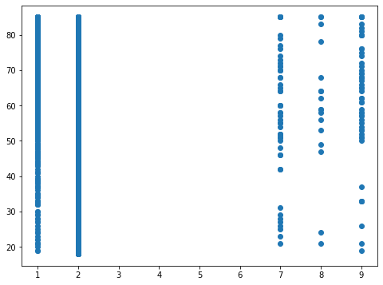
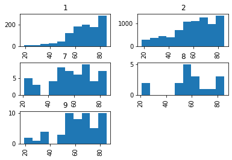

# Social Determinants in Health 
---
**Goals:** 

*   to predict heart/stroke problems, they are indicated as variables LAHCA7 and LAHCA8 respectively.
*   to identify some variables you think would be relevant and trying out some summary using pandas, for example, get the percentage of categorical variables(ethnicity, marital status), average for continuous variables(age, income, etc), or  plotting


```
import numpy as np
import pandas as pd
import matplotlib.pyplot as plt
persons_data = pd.read_csv('https://raw.githubusercontent.com/MaxShalom/arise/master/personsx1.csv', delimiter = ',')
print(persons_data)
```

          FPX  AGE_CHG  INTV_QRT  SEX  ...  ARMFTM4P  ARMFTM5P  ARMFTM6P  ENGLANG
    0       1      NaN         1    1  ...       NaN       NaN       NaN        1
    1       1      NaN         1    1  ...       NaN       NaN       NaN        1
    2       1      NaN         1    1  ...       NaN       NaN       NaN        1
    3       1      NaN         1    2  ...       NaN       NaN       NaN        1
    4       1      NaN         1    1  ...       1.0       NaN       NaN        1
    ...   ...      ...       ...  ...  ...       ...       ...       ...      ...
    9283    1      NaN         4    1  ...       NaN       NaN       NaN        1
    9284    1      NaN         4    2  ...       NaN       NaN       NaN        1
    9285    1      NaN         4    2  ...       NaN       NaN       NaN        1
    9286    1      NaN         4    2  ...       NaN       NaN       NaN        3
    9287    1      NaN         4    2  ...       NaN       NaN       NaN        1
    
    [9288 rows x 602 columns]
    


```
# Male v. Female COUNT (1= Male, 2=Female)
persons_data.groupby("SEX").count()
```


<div>
<style scoped>
    .dataframe tbody tr th:only-of-type {
        vertical-align: middle;
    }

    .dataframe tbody tr th {
        vertical-align: top;
    }

    .dataframe thead th {
        text-align: right;
    }
</style>
<table border="1" class="dataframe">
  <thead>
    <tr style="text-align: right;">
      <th></th>
      <th>FPX</th>
      <th>AGE_CHG</th>
      <th>INTV_QRT</th>
      <th>NOWAF</th>
      <th>FSPOUS2</th>
      <th>COHAB1</th>
      <th>COHAB2</th>
      <th>FCOHAB3</th>
      <th>ASTATFLG</th>
      <th>CSTATFLG</th>
      <th>FMX</th>
      <th>RRP</th>
      <th>FRRP</th>
      <th>ORIGIN_I</th>
      <th>HISPAN_I</th>
      <th>RACRECI3</th>
      <th>QCADULT</th>
      <th>QCCHILD</th>
      <th>R_MARITL</th>
      <th>MRACRPI2</th>
      <th>RACERPI2</th>
      <th>HISCODI3</th>
      <th>MRACBPI2</th>
      <th>AGE_P</th>
      <th>HHREFLG</th>
      <th>RECTYPE</th>
      <th>SRVY_YR</th>
      <th>FMREFLG</th>
      <th>FMRPFLG</th>
      <th>PARENTS</th>
      <th>DAD_DEGP</th>
      <th>MOM_DEGP</th>
      <th>SIB_DEGP</th>
      <th>CDCMSTAT</th>
      <th>DAD_ED</th>
      <th>MOM_ED</th>
      <th>FMOTHER1</th>
      <th>FFATHER1</th>
      <th>HHX</th>
      <th>WTIA</th>
      <th>...</th>
      <th>MAFLG</th>
      <th>CHFLG</th>
      <th>OPFLG</th>
      <th>OGFLG</th>
      <th>WHONAM1</th>
      <th>WHONAM2</th>
      <th>NOTCOV</th>
      <th>PRPLPLUS</th>
      <th>PWRKBR1</th>
      <th>COVER</th>
      <th>COVER65O</th>
      <th>COVER65</th>
      <th>REGIONBR</th>
      <th>WHYNOWKP</th>
      <th>GEOBRTH</th>
      <th>YRSINUS</th>
      <th>CITIZENP</th>
      <th>DOINGLWP</th>
      <th>WRKLYR1</th>
      <th>WRKHRS2</th>
      <th>PLBORN</th>
      <th>HEADST</th>
      <th>HEADSTV1</th>
      <th>ARMFVER</th>
      <th>ARMFEV</th>
      <th>ARMFFC</th>
      <th>VACOV</th>
      <th>WRKFTALL</th>
      <th>WRKMYR</th>
      <th>HIEMPOF</th>
      <th>EDUC1</th>
      <th>ERNYR_P</th>
      <th>ARMFTM7P</th>
      <th>ARMFTM1P</th>
      <th>ARMFTM2P</th>
      <th>ARMFTM3P</th>
      <th>ARMFTM4P</th>
      <th>ARMFTM5P</th>
      <th>ARMFTM6P</th>
      <th>ENGLANG</th>
    </tr>
    <tr>
      <th>SEX</th>
      <th></th>
      <th></th>
      <th></th>
      <th></th>
      <th></th>
      <th></th>
      <th></th>
      <th></th>
      <th></th>
      <th></th>
      <th></th>
      <th></th>
      <th></th>
      <th></th>
      <th></th>
      <th></th>
      <th></th>
      <th></th>
      <th></th>
      <th></th>
      <th></th>
      <th></th>
      <th></th>
      <th></th>
      <th></th>
      <th></th>
      <th></th>
      <th></th>
      <th></th>
      <th></th>
      <th></th>
      <th></th>
      <th></th>
      <th></th>
      <th></th>
      <th></th>
      <th></th>
      <th></th>
      <th></th>
      <th></th>
      <th></th>
      <th></th>
      <th></th>
      <th></th>
      <th></th>
      <th></th>
      <th></th>
      <th></th>
      <th></th>
      <th></th>
      <th></th>
      <th></th>
      <th></th>
      <th></th>
      <th></th>
      <th></th>
      <th></th>
      <th></th>
      <th></th>
      <th></th>
      <th></th>
      <th></th>
      <th></th>
      <th></th>
      <th></th>
      <th></th>
      <th></th>
      <th></th>
      <th></th>
      <th></th>
      <th></th>
      <th></th>
      <th></th>
      <th></th>
      <th></th>
      <th></th>
      <th></th>
      <th></th>
      <th></th>
      <th></th>
      <th></th>
    </tr>
  </thead>
  <tbody>
    <tr>
      <th>1</th>
      <td>4208</td>
      <td>0</td>
      <td>4208</td>
      <td>2356</td>
      <td>2020</td>
      <td>230</td>
      <td>145</td>
      <td>230</td>
      <td>4208</td>
      <td>0</td>
      <td>4208</td>
      <td>4208</td>
      <td>4208</td>
      <td>4208</td>
      <td>4208</td>
      <td>4208</td>
      <td>2</td>
      <td>0</td>
      <td>4208</td>
      <td>4208</td>
      <td>4208</td>
      <td>4208</td>
      <td>4208</td>
      <td>4208</td>
      <td>2542</td>
      <td>4208</td>
      <td>4208</td>
      <td>2578</td>
      <td>2431</td>
      <td>4208</td>
      <td>279</td>
      <td>484</td>
      <td>55</td>
      <td>4208</td>
      <td>0</td>
      <td>0</td>
      <td>4208</td>
      <td>4208</td>
      <td>4208</td>
      <td>4208</td>
      <td>...</td>
      <td>6</td>
      <td>0</td>
      <td>0</td>
      <td>0</td>
      <td>1652</td>
      <td>63</td>
      <td>4208</td>
      <td>1635</td>
      <td>203</td>
      <td>2356</td>
      <td>1852</td>
      <td>1852</td>
      <td>4208</td>
      <td>3225</td>
      <td>4208</td>
      <td>449</td>
      <td>4208</td>
      <td>4208</td>
      <td>4208</td>
      <td>975</td>
      <td>4208</td>
      <td>0</td>
      <td>0</td>
      <td>12</td>
      <td>4208</td>
      <td>1305</td>
      <td>924</td>
      <td>380</td>
      <td>1143</td>
      <td>918</td>
      <td>4208</td>
      <td>1143</td>
      <td>216</td>
      <td>1039</td>
      <td>1234</td>
      <td>1216</td>
      <td>1035</td>
      <td>698</td>
      <td>368</td>
      <td>4208</td>
    </tr>
    <tr>
      <th>2</th>
      <td>5080</td>
      <td>0</td>
      <td>5080</td>
      <td>2581</td>
      <td>1841</td>
      <td>243</td>
      <td>154</td>
      <td>243</td>
      <td>5080</td>
      <td>0</td>
      <td>5080</td>
      <td>5080</td>
      <td>5080</td>
      <td>5080</td>
      <td>5080</td>
      <td>5080</td>
      <td>6</td>
      <td>0</td>
      <td>5080</td>
      <td>5080</td>
      <td>5080</td>
      <td>5080</td>
      <td>5080</td>
      <td>5080</td>
      <td>3248</td>
      <td>5080</td>
      <td>5080</td>
      <td>3286</td>
      <td>3442</td>
      <td>5080</td>
      <td>152</td>
      <td>309</td>
      <td>76</td>
      <td>5080</td>
      <td>0</td>
      <td>0</td>
      <td>5080</td>
      <td>5080</td>
      <td>5080</td>
      <td>5080</td>
      <td>...</td>
      <td>14</td>
      <td>0</td>
      <td>4</td>
      <td>0</td>
      <td>2086</td>
      <td>75</td>
      <td>5080</td>
      <td>2065</td>
      <td>203</td>
      <td>2581</td>
      <td>2499</td>
      <td>2499</td>
      <td>5080</td>
      <td>4161</td>
      <td>5080</td>
      <td>669</td>
      <td>5080</td>
      <td>5080</td>
      <td>5080</td>
      <td>962</td>
      <td>5080</td>
      <td>0</td>
      <td>0</td>
      <td>3</td>
      <td>5080</td>
      <td>99</td>
      <td>75</td>
      <td>452</td>
      <td>1095</td>
      <td>880</td>
      <td>5080</td>
      <td>1095</td>
      <td>7</td>
      <td>90</td>
      <td>84</td>
      <td>80</td>
      <td>47</td>
      <td>22</td>
      <td>11</td>
      <td>5080</td>
    </tr>
  </tbody>
</table>
<p>2 rows × 601 columns</p>
</div>


```
persons_data.groupby("LAHCA7").count()
```


<div>
<style scoped>
    .dataframe tbody tr th:only-of-type {
        vertical-align: middle;
    }

    .dataframe tbody tr th {
        vertical-align: top;
    }

    .dataframe thead th {
        text-align: right;
    }
</style>
<table border="1" class="dataframe">
  <thead>
    <tr style="text-align: right;">
      <th></th>
      <th>FPX</th>
      <th>AGE_CHG</th>
      <th>INTV_QRT</th>
      <th>SEX</th>
      <th>NOWAF</th>
      <th>FSPOUS2</th>
      <th>COHAB1</th>
      <th>COHAB2</th>
      <th>FCOHAB3</th>
      <th>ASTATFLG</th>
      <th>CSTATFLG</th>
      <th>FMX</th>
      <th>RRP</th>
      <th>FRRP</th>
      <th>ORIGIN_I</th>
      <th>HISPAN_I</th>
      <th>RACRECI3</th>
      <th>QCADULT</th>
      <th>QCCHILD</th>
      <th>R_MARITL</th>
      <th>MRACRPI2</th>
      <th>RACERPI2</th>
      <th>HISCODI3</th>
      <th>MRACBPI2</th>
      <th>AGE_P</th>
      <th>HHREFLG</th>
      <th>RECTYPE</th>
      <th>SRVY_YR</th>
      <th>FMREFLG</th>
      <th>FMRPFLG</th>
      <th>PARENTS</th>
      <th>DAD_DEGP</th>
      <th>MOM_DEGP</th>
      <th>SIB_DEGP</th>
      <th>CDCMSTAT</th>
      <th>DAD_ED</th>
      <th>MOM_ED</th>
      <th>FMOTHER1</th>
      <th>FFATHER1</th>
      <th>HHX</th>
      <th>...</th>
      <th>MAFLG</th>
      <th>CHFLG</th>
      <th>OPFLG</th>
      <th>OGFLG</th>
      <th>WHONAM1</th>
      <th>WHONAM2</th>
      <th>NOTCOV</th>
      <th>PRPLPLUS</th>
      <th>PWRKBR1</th>
      <th>COVER</th>
      <th>COVER65O</th>
      <th>COVER65</th>
      <th>REGIONBR</th>
      <th>WHYNOWKP</th>
      <th>GEOBRTH</th>
      <th>YRSINUS</th>
      <th>CITIZENP</th>
      <th>DOINGLWP</th>
      <th>WRKLYR1</th>
      <th>WRKHRS2</th>
      <th>PLBORN</th>
      <th>HEADST</th>
      <th>HEADSTV1</th>
      <th>ARMFVER</th>
      <th>ARMFEV</th>
      <th>ARMFFC</th>
      <th>VACOV</th>
      <th>WRKFTALL</th>
      <th>WRKMYR</th>
      <th>HIEMPOF</th>
      <th>EDUC1</th>
      <th>ERNYR_P</th>
      <th>ARMFTM7P</th>
      <th>ARMFTM1P</th>
      <th>ARMFTM2P</th>
      <th>ARMFTM3P</th>
      <th>ARMFTM4P</th>
      <th>ARMFTM5P</th>
      <th>ARMFTM6P</th>
      <th>ENGLANG</th>
    </tr>
    <tr>
      <th>LAHCA7</th>
      <th></th>
      <th></th>
      <th></th>
      <th></th>
      <th></th>
      <th></th>
      <th></th>
      <th></th>
      <th></th>
      <th></th>
      <th></th>
      <th></th>
      <th></th>
      <th></th>
      <th></th>
      <th></th>
      <th></th>
      <th></th>
      <th></th>
      <th></th>
      <th></th>
      <th></th>
      <th></th>
      <th></th>
      <th></th>
      <th></th>
      <th></th>
      <th></th>
      <th></th>
      <th></th>
      <th></th>
      <th></th>
      <th></th>
      <th></th>
      <th></th>
      <th></th>
      <th></th>
      <th></th>
      <th></th>
      <th></th>
      <th></th>
      <th></th>
      <th></th>
      <th></th>
      <th></th>
      <th></th>
      <th></th>
      <th></th>
      <th></th>
      <th></th>
      <th></th>
      <th></th>
      <th></th>
      <th></th>
      <th></th>
      <th></th>
      <th></th>
      <th></th>
      <th></th>
      <th></th>
      <th></th>
      <th></th>
      <th></th>
      <th></th>
      <th></th>
      <th></th>
      <th></th>
      <th></th>
      <th></th>
      <th></th>
      <th></th>
      <th></th>
      <th></th>
      <th></th>
      <th></th>
      <th></th>
      <th></th>
      <th></th>
      <th></th>
      <th></th>
      <th></th>
    </tr>
  </thead>
  <tbody>
    <tr>
      <th>1</th>
      <td>1103</td>
      <td>0</td>
      <td>1103</td>
      <td>1103</td>
      <td>414</td>
      <td>456</td>
      <td>46</td>
      <td>36</td>
      <td>46</td>
      <td>1103</td>
      <td>0</td>
      <td>1103</td>
      <td>1103</td>
      <td>1103</td>
      <td>1103</td>
      <td>1103</td>
      <td>1103</td>
      <td>0</td>
      <td>0</td>
      <td>1103</td>
      <td>1103</td>
      <td>1103</td>
      <td>1103</td>
      <td>1103</td>
      <td>1103</td>
      <td>722</td>
      <td>1103</td>
      <td>1103</td>
      <td>727</td>
      <td>700</td>
      <td>1103</td>
      <td>28</td>
      <td>50</td>
      <td>8</td>
      <td>1103</td>
      <td>0</td>
      <td>0</td>
      <td>1103</td>
      <td>1103</td>
      <td>1103</td>
      <td>...</td>
      <td>2</td>
      <td>0</td>
      <td>1</td>
      <td>0</td>
      <td>412</td>
      <td>17</td>
      <td>1103</td>
      <td>405</td>
      <td>33</td>
      <td>414</td>
      <td>689</td>
      <td>689</td>
      <td>1103</td>
      <td>978</td>
      <td>1103</td>
      <td>121</td>
      <td>1103</td>
      <td>1103</td>
      <td>1103</td>
      <td>133</td>
      <td>1103</td>
      <td>0</td>
      <td>0</td>
      <td>1</td>
      <td>1103</td>
      <td>236</td>
      <td>168</td>
      <td>69</td>
      <td>163</td>
      <td>120</td>
      <td>1103</td>
      <td>163</td>
      <td>40</td>
      <td>187</td>
      <td>230</td>
      <td>235</td>
      <td>208</td>
      <td>146</td>
      <td>77</td>
      <td>1103</td>
    </tr>
    <tr>
      <th>2</th>
      <td>8062</td>
      <td>0</td>
      <td>8062</td>
      <td>8062</td>
      <td>4453</td>
      <td>3351</td>
      <td>415</td>
      <td>259</td>
      <td>415</td>
      <td>8062</td>
      <td>0</td>
      <td>8062</td>
      <td>8062</td>
      <td>8062</td>
      <td>8062</td>
      <td>8062</td>
      <td>8062</td>
      <td>6</td>
      <td>0</td>
      <td>8062</td>
      <td>8062</td>
      <td>8062</td>
      <td>8062</td>
      <td>8062</td>
      <td>8062</td>
      <td>4998</td>
      <td>8062</td>
      <td>8062</td>
      <td>5065</td>
      <td>5101</td>
      <td>8062</td>
      <td>400</td>
      <td>734</td>
      <td>118</td>
      <td>8062</td>
      <td>0</td>
      <td>0</td>
      <td>8062</td>
      <td>8062</td>
      <td>8062</td>
      <td>...</td>
      <td>18</td>
      <td>0</td>
      <td>3</td>
      <td>0</td>
      <td>3275</td>
      <td>119</td>
      <td>8062</td>
      <td>3244</td>
      <td>371</td>
      <td>4453</td>
      <td>3609</td>
      <td>3609</td>
      <td>8062</td>
      <td>6323</td>
      <td>8062</td>
      <td>982</td>
      <td>8062</td>
      <td>8062</td>
      <td>8062</td>
      <td>1767</td>
      <td>8062</td>
      <td>0</td>
      <td>0</td>
      <td>13</td>
      <td>8062</td>
      <td>1149</td>
      <td>814</td>
      <td>746</td>
      <td>2037</td>
      <td>1642</td>
      <td>8062</td>
      <td>2037</td>
      <td>179</td>
      <td>927</td>
      <td>1071</td>
      <td>1042</td>
      <td>862</td>
      <td>565</td>
      <td>297</td>
      <td>8062</td>
    </tr>
    <tr>
      <th>7</th>
      <td>53</td>
      <td>0</td>
      <td>53</td>
      <td>53</td>
      <td>32</td>
      <td>25</td>
      <td>4</td>
      <td>1</td>
      <td>4</td>
      <td>53</td>
      <td>0</td>
      <td>53</td>
      <td>53</td>
      <td>53</td>
      <td>53</td>
      <td>53</td>
      <td>53</td>
      <td>2</td>
      <td>0</td>
      <td>53</td>
      <td>53</td>
      <td>53</td>
      <td>53</td>
      <td>53</td>
      <td>53</td>
      <td>34</td>
      <td>53</td>
      <td>53</td>
      <td>35</td>
      <td>32</td>
      <td>53</td>
      <td>1</td>
      <td>3</td>
      <td>2</td>
      <td>53</td>
      <td>0</td>
      <td>0</td>
      <td>53</td>
      <td>53</td>
      <td>53</td>
      <td>...</td>
      <td>0</td>
      <td>0</td>
      <td>0</td>
      <td>0</td>
      <td>26</td>
      <td>1</td>
      <td>53</td>
      <td>26</td>
      <td>0</td>
      <td>32</td>
      <td>21</td>
      <td>21</td>
      <td>53</td>
      <td>37</td>
      <td>53</td>
      <td>2</td>
      <td>53</td>
      <td>53</td>
      <td>53</td>
      <td>15</td>
      <td>53</td>
      <td>0</td>
      <td>0</td>
      <td>0</td>
      <td>53</td>
      <td>8</td>
      <td>7</td>
      <td>5</td>
      <td>16</td>
      <td>15</td>
      <td>53</td>
      <td>16</td>
      <td>2</td>
      <td>6</td>
      <td>7</td>
      <td>8</td>
      <td>5</td>
      <td>4</td>
      <td>2</td>
      <td>53</td>
    </tr>
    <tr>
      <th>8</th>
      <td>17</td>
      <td>0</td>
      <td>17</td>
      <td>17</td>
      <td>12</td>
      <td>9</td>
      <td>1</td>
      <td>0</td>
      <td>1</td>
      <td>17</td>
      <td>0</td>
      <td>17</td>
      <td>17</td>
      <td>17</td>
      <td>17</td>
      <td>17</td>
      <td>17</td>
      <td>0</td>
      <td>0</td>
      <td>17</td>
      <td>17</td>
      <td>17</td>
      <td>17</td>
      <td>17</td>
      <td>17</td>
      <td>11</td>
      <td>17</td>
      <td>17</td>
      <td>11</td>
      <td>12</td>
      <td>17</td>
      <td>1</td>
      <td>3</td>
      <td>0</td>
      <td>17</td>
      <td>0</td>
      <td>0</td>
      <td>17</td>
      <td>17</td>
      <td>17</td>
      <td>...</td>
      <td>0</td>
      <td>0</td>
      <td>0</td>
      <td>0</td>
      <td>10</td>
      <td>1</td>
      <td>17</td>
      <td>10</td>
      <td>0</td>
      <td>12</td>
      <td>5</td>
      <td>5</td>
      <td>17</td>
      <td>8</td>
      <td>17</td>
      <td>1</td>
      <td>17</td>
      <td>17</td>
      <td>17</td>
      <td>9</td>
      <td>17</td>
      <td>0</td>
      <td>0</td>
      <td>0</td>
      <td>17</td>
      <td>2</td>
      <td>2</td>
      <td>3</td>
      <td>9</td>
      <td>9</td>
      <td>17</td>
      <td>9</td>
      <td>0</td>
      <td>2</td>
      <td>2</td>
      <td>2</td>
      <td>1</td>
      <td>0</td>
      <td>0</td>
      <td>17</td>
    </tr>
    <tr>
      <th>9</th>
      <td>53</td>
      <td>0</td>
      <td>53</td>
      <td>53</td>
      <td>26</td>
      <td>20</td>
      <td>7</td>
      <td>3</td>
      <td>7</td>
      <td>53</td>
      <td>0</td>
      <td>53</td>
      <td>53</td>
      <td>53</td>
      <td>53</td>
      <td>53</td>
      <td>53</td>
      <td>0</td>
      <td>0</td>
      <td>53</td>
      <td>53</td>
      <td>53</td>
      <td>53</td>
      <td>53</td>
      <td>53</td>
      <td>25</td>
      <td>53</td>
      <td>53</td>
      <td>26</td>
      <td>28</td>
      <td>53</td>
      <td>1</td>
      <td>3</td>
      <td>3</td>
      <td>53</td>
      <td>0</td>
      <td>0</td>
      <td>53</td>
      <td>53</td>
      <td>53</td>
      <td>...</td>
      <td>0</td>
      <td>0</td>
      <td>0</td>
      <td>0</td>
      <td>15</td>
      <td>0</td>
      <td>53</td>
      <td>15</td>
      <td>2</td>
      <td>26</td>
      <td>27</td>
      <td>27</td>
      <td>53</td>
      <td>40</td>
      <td>53</td>
      <td>12</td>
      <td>53</td>
      <td>53</td>
      <td>53</td>
      <td>13</td>
      <td>53</td>
      <td>0</td>
      <td>0</td>
      <td>1</td>
      <td>53</td>
      <td>9</td>
      <td>8</td>
      <td>9</td>
      <td>13</td>
      <td>12</td>
      <td>53</td>
      <td>13</td>
      <td>2</td>
      <td>7</td>
      <td>8</td>
      <td>9</td>
      <td>6</td>
      <td>5</td>
      <td>3</td>
      <td>53</td>
    </tr>
  </tbody>
</table>
<p>5 rows × 601 columns</p>
</div>


```
persons_data[["LAHCA7", "LAHCA8"]].describe()
```


<div>
<style scoped>
    .dataframe tbody tr th:only-of-type {
        vertical-align: middle;
    }

    .dataframe tbody tr th {
        vertical-align: top;
    }

    .dataframe thead th {
        text-align: right;
    }
</style>
<table border="1" class="dataframe">
  <thead>
    <tr style="text-align: right;">
      <th></th>
      <th>LAHCA7</th>
      <th>LAHCA8</th>
    </tr>
  </thead>
  <tbody>
    <tr>
      <th>count</th>
      <td>9288.000000</td>
      <td>9288.000000</td>
    </tr>
    <tr>
      <th>mean</th>
      <td>1.960702</td>
      <td>2.026055</td>
    </tr>
    <tr>
      <th>std</th>
      <td>0.778096</td>
      <td>0.735485</td>
    </tr>
    <tr>
      <th>min</th>
      <td>1.000000</td>
      <td>1.000000</td>
    </tr>
    <tr>
      <th>25%</th>
      <td>2.000000</td>
      <td>2.000000</td>
    </tr>
    <tr>
      <th>50%</th>
      <td>2.000000</td>
      <td>2.000000</td>
    </tr>
    <tr>
      <th>75%</th>
      <td>2.000000</td>
      <td>2.000000</td>
    </tr>
    <tr>
      <th>max</th>
      <td>9.000000</td>
      <td>9.000000</td>
    </tr>
  </tbody>
</table>
</div>


```
persons_data["LAHCA7"].value_counts()
```


    2    8062
    1    1103
    7      53
    9      53
    8      17
    Name: LAHCA7, dtype: int64


```
p=persons_data.groupby(["LAHCA7", "R_MARITL"]).size().reset_index(name="Count")
print(p)
```

        LAHCA7  R_MARITL  Count
    0        1         1    456
    1        1         2     11
    2        1         4    238
    3        1         5    198
    4        1         6     35
    5        1         7    118
    6        1         8     46
    7        1         9      1
    8        2         1   3351
    9        2         2    100
    10       2         4   1273
    11       2         5   1213
    12       2         6    202
    13       2         7   1490
    14       2         8    415
    15       2         9     18
    16       7         1     25
    17       7         2      1
    18       7         4      5
    19       7         5      7
    20       7         6      1
    21       7         7      8
    22       7         8      4
    23       7         9      2
    24       8         1      9
    25       8         2      1
    26       8         4      3
    27       8         7      3
    28       8         8      1
    29       9         1     20
    30       9         2      1
    31       9         4      4
    32       9         5      7
    33       9         6      4
    34       9         7     10
    35       9         8      7
    


```
pd.crosstab(persons_data.LAHCA7, persons_data.R_MARITL).apply(lambda r: r/r.sum(), axis=1)
```


<div>
<style scoped>
    .dataframe tbody tr th:only-of-type {
        vertical-align: middle;
    }

    .dataframe tbody tr th {
        vertical-align: top;
    }

    .dataframe thead th {
        text-align: right;
    }
</style>
<table border="1" class="dataframe">
  <thead>
    <tr style="text-align: right;">
      <th>R_MARITL</th>
      <th>1</th>
      <th>2</th>
      <th>4</th>
      <th>5</th>
      <th>6</th>
      <th>7</th>
      <th>8</th>
      <th>9</th>
    </tr>
    <tr>
      <th>LAHCA7</th>
      <th></th>
      <th></th>
      <th></th>
      <th></th>
      <th></th>
      <th></th>
      <th></th>
      <th></th>
    </tr>
  </thead>
  <tbody>
    <tr>
      <th>1</th>
      <td>0.413418</td>
      <td>0.009973</td>
      <td>0.215775</td>
      <td>0.179510</td>
      <td>0.031732</td>
      <td>0.106981</td>
      <td>0.041704</td>
      <td>0.000907</td>
    </tr>
    <tr>
      <th>2</th>
      <td>0.415654</td>
      <td>0.012404</td>
      <td>0.157901</td>
      <td>0.150459</td>
      <td>0.025056</td>
      <td>0.184818</td>
      <td>0.051476</td>
      <td>0.002233</td>
    </tr>
    <tr>
      <th>7</th>
      <td>0.471698</td>
      <td>0.018868</td>
      <td>0.094340</td>
      <td>0.132075</td>
      <td>0.018868</td>
      <td>0.150943</td>
      <td>0.075472</td>
      <td>0.037736</td>
    </tr>
    <tr>
      <th>8</th>
      <td>0.529412</td>
      <td>0.058824</td>
      <td>0.176471</td>
      <td>0.000000</td>
      <td>0.000000</td>
      <td>0.176471</td>
      <td>0.058824</td>
      <td>0.000000</td>
    </tr>
    <tr>
      <th>9</th>
      <td>0.377358</td>
      <td>0.018868</td>
      <td>0.075472</td>
      <td>0.132075</td>
      <td>0.075472</td>
      <td>0.188679</td>
      <td>0.132075</td>
      <td>0.000000</td>
    </tr>
  </tbody>
</table>
</div>


```
# Calculated mean by different groups##
persons_data.groupby('LAHCA7')['AGE_P'].mean()
```


    LAHCA7
    1    67.620127
    2    60.266807
    7    57.905660
    8    59.705882
    9    62.056604
    Name: AGE_P, dtype: float64


```
# Scatterplot by group and compare differences
fig, ax = plt.subplots(figsize=(8,6))
ax.scatter(persons_data.LAHCA7, persons_data.AGE_P, cmap='tab20b')
plt.show()
```





```
persons_data['AGE_P'].hist(by=persons_data['LAHCA7'])
```


    array([[<matplotlib.axes._subplots.AxesSubplot object at 0x7f4282c81cf8>,
            <matplotlib.axes._subplots.AxesSubplot object at 0x7f428316cc50>],
           [<matplotlib.axes._subplots.AxesSubplot object at 0x7f4284214b00>,
            <matplotlib.axes._subplots.AxesSubplot object at 0x7f428293a8d0>],
           [<matplotlib.axes._subplots.AxesSubplot object at 0x7f42828f3b38>,
            <matplotlib.axes._subplots.AxesSubplot object at 0x7f42828a6da0>]],
          dtype=object)




